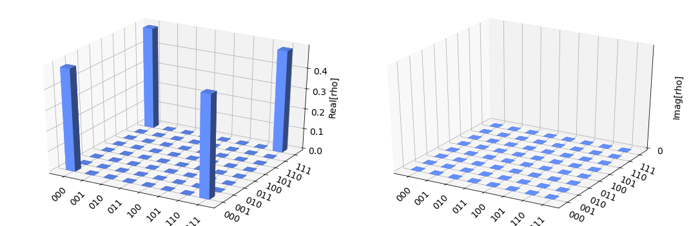
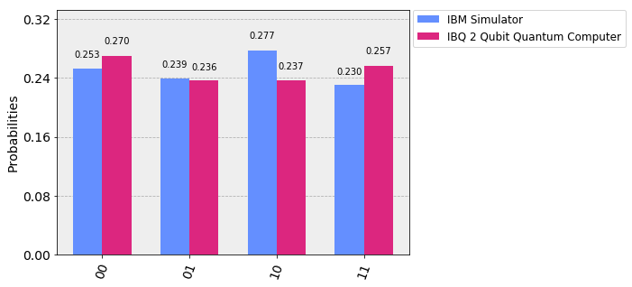

# Implementation of Modified Talbi's Quantum Inspired Genetic Algorithm for Travelling Salesman Problem on an IBM Quantum Computer
---
[](https://qiskit.org/)
[](https://www.python.org/)
[](https://link.springer.com/chapter/10.1007/978-3-030-63089-8_6)

## 📌 Research Overview
This repository contains the groundbreaking implementation of a **Modified Talbi's Quantum-Inspired Genetic Algorithm (QIGA)** designed to solve the **Travelling Salesman Problem (TSP)**. This project marks a significant milestone as it represents the first time Talbi's QIGA has been successfully implemented and executed on a real **IBM Quantum Computer**.

The research associated with this implementation was published in the *Proceedings of the Future Technologies Conference (FTC) 2020*, Volume 2, and is included in the *Advances in Intelligent Systems and Computing* book series (Springer, 2021).

**Reference Paper:**  
[Implementation of Modified Talbi's Quantum Inspired Genetic Algorithm for Travelling Salesman Problem on an IBM Quantum Computer](https://link.springer.com/chapter/10.1007/978-3-030-63089-8_6)  
*Authors: Adhisha Chamikara Gammanpila, T.G.I. Fernando*

---

## 📖 The Full Story: From Theory to Hardware

### 1. The Scientific Blocker: The No-Cloning Theorem
The fundamental challenge in porting Classical Quantum-Inspired Genetic Algorithms (QIGAs) to real quantum hardware lies in a law of physics: the **No-Cloning Theorem**. 

Standard QIGAs often involve "replicating" the state of a qubit to evaluate different paths or fitnesses simultaneously. On a classical simulator, this is trivial (just copying a variable). However, in a real quantum system, you cannot copy an unknown quantum state without collapsing it. This research identifies this structural incompatibility as the primary reason why many theoretical QIGAs remain stuck in simulation.

### 2. The Solution: Structural Modification
The "Modified Talbi" approach overcomes this by redesigning the evolutionary operators (Selection, Crossover, and Mutation) to work within the constraints of quantum circuits. Instead of copying states, the algorithm uses **Quantum Interference** (via Phase gates like $T$ gates) and **Entanglement** to explore the search space.

### 3. The Experimental Roadmap

#### **Phase A: GHZ State Preparation**
The algorithm begins by creating complex entangled states. For a 3-city problem, we prepare a **Greenberger–Horne–Zeilinger (GHZ) state** to represent the initial population superposition.

**The Quantum Circuit:**
```text
        ┌───┐          
q_0: |0>┤ H ├──■────■──
        └───┘┌─┴─┐  │  
q_1: |0>─────┤ X ├──┼──
             └───┘┌─┴─┐
q_2: |0>──────────┤ X ├
                  └───┘
```

**State Density Matrix Visualization:**
The image below shows the theoretical density matrix (Real and Imaginary components) for the prepared GHZ state, demonstrating perfect superposition and entanglement.



#### **Phase B: Modified Evolutionary Cycle**
Unlike classical GA, where individuals are bitstrings, here the "population" is a quantum state.
*   **Quantum Crossover**: Implemented by swapping qubit channels or applying Controlled-SWAP gates.
*   **Quantum Mutation**: Applied via $T$ gates (phase shifts) to create interference, allowing the algorithm to "tunnel" through local minima in the TSP distance landscape.

#### **Phase C: Real Hardware Benchmarking**
The algorithm was executed on the **IBM 2-Qubit Quantum Computer (IBQ)**. The "Full Story" concludes with a rigorous comparison between the noiseless simulation and the real, noisy hardware.


*Figure: The histogram reveals how real hardware noise (decoherence) impacts the theoretical probability distribution, a crucial insight for NISQ-era algorithm development.*

---

## 🔬 Results and Conclusion
While the study noted that the QIGA did not achieve an optimal level of convergence when compared head-to-head with a highly optimized Classical Genetic Algorithm for the TSP, the primary achievement of this work is the **successful structural modification** that enables complex quantum-inspired evolutionary algorithms to be executed on physical quantum processors.

---

## 💻 Repository Structure & Usage

The project is built using Python and the IBM Qiskit framework. 

*   `quantum_inspired_genetic_algorithm_qiskit_implementation_for_tsp.ipynb`: Main implementation notebook.
*   `project_01_python_simulation.ipynb`: Phase 1: Basic Qubit state simulations.
*   `project_01_and_02_python_simulation.ipynb`: Phase 2: Full TSP Simulation vs Hardware comparison.
*   `visuals/`: Extracted plots and visualizations.

### Prerequisites
```bash
pip install qiskit numpy matplotlib
```

---
*Pioneering the intersection of Evolutionary Computation and Quantum Mechanics.*
